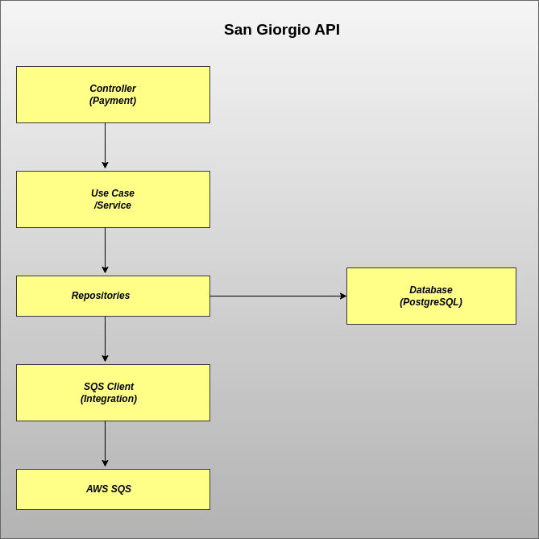

# SanGiorgioApplication

Este é um projeto Spring Boot que gerencia o processamento de pagamentos para vendedores, validando os pagamentos e enviando informações para diferentes filas do AWS SQS com base no status do pagamento (parcial, total ou excedente).

## Funcionalidades

- Processamento de pagamentos com validação de vendedor e código da cobrança.
- Diferenciação de pagamentos parciais, totais ou excedentes.
- Envio de mensagens para filas SQS específicas conforme o tipo de pagamento.
- Integração com AWS SDK para enviar mensagens às filas SQS.
- Exposição de uma API REST para o recebimento e processamento de pagamentos.

## Tecnologias Utilizadas

- Java 17
- Spring Boot 3
- PostgreSQL
- AWS SDK (SQS)
- Jakarta Persistence API (JPA)
- JUnit 5 para testes unitários
- Maven como ferramenta de build

## Pré-requisitos

- Java 17 instalado
- Maven instalado
- PostgreSQL configurado e em execução
- AWS SQS configurado (credenciais de acesso configuradas no arquivo application.yaml)

## Configuração

1. Clone o repositório: git@github.com:augustczar/san-giorgio-api.git

